# X / OpenAI Split-DNS Proxy Design

## Goal

Build a minimal and safe TCP-443-only proxy path on `129.204.9.74` so that selected `X` and `OpenAI/Codex` domains can be redirected through the cloud host without TLS interception.

Client requirements:

- system-level behavior on macOS and Windows
- split DNS instead of browser-only settings
- no UDP support

Server requirements:

- keep existing `zzetz.cn` online
- reuse existing `nginx`
- reuse existing `mihomo`
- avoid certificate replacement and HTTPS MITM

## Final Server Architecture

The original idea was `nginx stream + redsocks`, but the actual host constraints changed the implementation:

- the installed `nginx 1.14.1` has a dynamic `stream` module but does not support `ssl_preread`
- `redsocks` was not available from the server package sources
- direct DNS for `chatgpt.com` was polluted on this host, so pure hostname passthrough was not enough

The implemented architecture is:

- `sniproxy` on public `:443` for SNI-based layer-4 routing
- existing `nginx` HTTPS site moved to `127.0.0.1:8443`
- `iptables nat OUTPUT` catches only `sniproxy` egress TCP
- captured traffic is redirected to `mihomo redir-port` on `127.0.0.1:7892`
- `mihomo` routes X/OpenAI domains through a dedicated `X-OPENAI` selector

## Traffic Flow

```text
Client macOS / Windows
  split DNS resolves selected domains -> 129.204.9.74
          |
          v
129.204.9.74:443
  sniproxy inspects TLS SNI
          |
          |-- if SNI matches X/OpenAI allowlist:
          |      forward TCP to requested upstream:443
          |      sniproxy egress is redirected to mihomo redir-port
          |      mihomo -> X-OPENAI -> proxy node
          |
          |-- otherwise:
                 hand off to local HTTPS site on 127.0.0.1:8443
                 existing zzetz.cn continues to work
```

## Module Diagram

```mermaid
flowchart LR
    A[Client macOS / Windows<br/>App or browser requests https://x.com<br/>System-level split DNS<br/>TCP 443 only] --> B[Local Split DNS<br/>dnsmasq / CoreDNS / Technitium<br/>Selected suffixes resolve to 129.204.9.74]

    B --> C[Client opens TLS connection<br/>dst 129.204.9.74:443<br/>SNI = x.com]

    C --> D[Cloud ingress 129.204.9.74:443<br/>sniproxy<br/>SNI-based layer-4 routing<br/>No TLS termination]
    D -->|SNI matches X / OpenAI groups| E[Proxy path<br/>Forward target = upstream:443<br/>Example x.com:443]
    D -->|SNI not matched| Z[Fallback local HTTPS site<br/>127.0.0.1:8443<br/>Existing zzetz.cn service]

    E --> F[Outbound interception<br/>iptables nat OUTPUT<br/>Only sniproxy-owned TCP egress<br/>Exclude loopback and internal ranges]
    F --> G[mihomo redir-port<br/>127.0.0.1:7892<br/>Transparent TCP handoff]
    G --> H[mihomo<br/>Rules target X-OPENAI group]
    H --> I[X-OPENAI / X-OPENAI-AUTO<br/>Allowed regions only:<br/>US -> JP -> SG -> KR]
    I --> J[Selected egress proxy node<br/>US / JP / SG / KR]

    J --> K[Real destination<br/>x.com:443]
    K --> J
    J --> I
    I --> H
    H --> G
    G --> F
    F --> E
    E --> D
    D --> C
```



## Domain Groups

### X Group

- `x.com`
- `twitter.com`
- `t.co`
- `twimg.com`

### OpenAI / Codex Group

- `openai.com`
- `chatgpt.com`
- `oaistatic.com`
- `oaiusercontent.com`
- `featuregates.org`
- `statsig.com`
- `statsigapi.net`
- `intercom.io`
- `intercomcdn.com`
- `workos.com`
- `workoscdn.com`
- `imgix.net`
- `sendgrid.net`

Notes:

- `platform.openai.com`, `api.openai.com`, `chat.openai.com`, `auth.openai.com`, and `desktop.chatgpt.com` are covered by suffix routing.
- client split DNS should point these suffixes to `129.204.9.74`.

## Current Implementation State

Implemented on `2026-04-21`:

- public `443` is owned by `sniproxy`
- local site `zzetz.cn` now listens on `127.0.0.1:8443`
- `mihomo` now exposes and uses `redir-port: 7892`
- `iptables` redirects only `sniproxy` user TCP egress into `7892`
- `mihomo` contains `X-OPENAI-AUTO` and `X-OPENAI`
- current validated default selector is `DaWang-US-Xr2`

Current key files and services:

- `/etc/sniproxy.conf`
- `/etc/systemd/system/sniproxy.service`
- `/usr/local/sbin/sniproxy-iptables.sh`
- `/etc/systemd/system/sniproxy-iptables.service`
- `/etc/nginx/conf.d/zzetz.cn.conf`
- `/etc/mihomo/config.yaml`

## DNS Constraint And ChatGPT Handling

This host returns polluted DNS answers for `chatgpt.com` on common public resolvers reachable directly from the server.

Observed on `2026-04-21`:

- direct resolver answers for `chatgpt.com` were incorrect
- `chatgpt.com` through `mihomo SOCKS5` was healthy
- `chatgpt.com` through `sniproxy` failed until the destination was pinned to a known-good Cloudflare edge IP

Implemented workaround:

- `(^|.*\\.)chatgpt\\.com$` is pinned in `/etc/sniproxy.conf` to `104.18.32.47:443`

Why this is acceptable here:

- the client still sends `SNI=chatgpt.com`
- TLS is still end-to-end with the real ChatGPT certificate
- Cloudflare edge IPs are shared front-door addresses, so SNI continues to select the correct site

Operational caveat:

- this pin may need refresh if ChatGPT edge routing changes
- if ChatGPT starts failing again while `platform.openai.com` still works, re-resolve `chatgpt.com` through a trusted DoH endpoint over `mihomo`, then update the pinned IP

## Why This Design Works

- client traffic remains standard HTTPS
- the cloud host only proxies at TCP layer using SNI
- certificates remain original third-party certificates
- `mihomo` handles restricted-destination egress
- non-matching SNI falls back to the existing local site instead of becoming an open proxy

## Validation Standard

Server-side success means:

- `x.com` over the front door returns a valid HTTPS response
- `chatgpt.com` and `platform.openai.com` over the front door return valid HTTPS responses
- `zzetz.cn` still returns the local site over the same public `443`
- `sniproxy`, `mihomo`, and `sniproxy-iptables` stay healthy after restart

Client rollout is separate:

- macOS and Windows still need local split DNS setup
- UDP/QUIC is intentionally not part of this design
